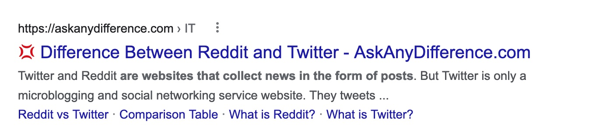

# 💚 Discontent

This aims to be an open, crowdsourced browser extension to fight garbage content on the web.

As of writing, if I type `difference between reddit and twitter` into [Google](https://www.google.com/search?q=difference%20between%20reddit%20and%20twitter), in the second result I get [this](https://askanydifference.com/difference-between-reddit-and-twitte/):

> Reddit is dependent on the users of the website. They need to not be registered users. Whereas, Twitter is dependent on the general public who are registered profile users of Twitter along with their editors.

Clearly this website is complete trash. With the advent of incredible AI tools like ChatGPT, I fear everyone out there that makes interesting and quality content will soon be buried by an immense ocean of AI generated, SEO optimised nonsense. All you lovely people producing good stuff, all I want to do is _find_ you. Use this extension to do so.

Inspired by my 💢 **deep hate** 💢 of those AI customer support bots. And unethical SEO consultants.

## How it works?

- If a website is in the database and it has a bad score, it'll prepend all your links with a 💢.
   </img>
- If it's spicy and there's lots of votes both ways, you see a 🤨.
- If it's awesome and deserves to be cherished, you see a 💚.
- When there aren't enough ratings, nothing will show up.

💚 When you find a site that is a beautiful smiling breath of fresh air; use the extension popup to vote and share your love.

💢 When you find a site that kicks down your door, calls you stupid and holds out its greasy hand demanding ad revenue; use the popup to warn the next bloke.

To get things off the ground, I've used the [front page submissions list](https://news.ycombinator.com/lists) from [HackerNews](https://news.ycombinator.com/news). I've gone back a year and taken the best 30 from each day to build a set of good links, hopefully that's a good starting point.

Works for Google, Bing & DuckDuckGo.

## Motivation

Historically we relied on the big search engines to filter out the good from the bad, and generally speaking they did a pretty good job. But all this generative AI stuff has them spooked and now we have to wade through a lot of rubbish to find anything half decent.

As an aside, rating platforms like this become useless when they start accepting money in exchange for ratings. My promise is that Discontent will never do this, so don't bother asking.

## Configuration

You can change the good / spicy / bad icons in the settings to something custom if you like. Maybe something like this?

| Setting | Icon |
| ------- | :--: |
| Good    |  😍  |
| Spicy   |  🌶   |
| Bad     |  🤮  |

## Technical

When you fire up a search engine, it'll grab a list of all the relevant links on the page, then hit an API asking for their scores.
When a user submits a vote it stores the vote, the timestamp and a randomly generated UUID for that user. No other user data is stored.

The extension itself is written in Typescript. The web API runs off an AWS lambda built in Rust, and the whole thing is backed by DynamoDB. There's some piecemeal python & ruby scripts for testing.

For the nuts and bolts, see the [Architecture](./docs/architecture.md) page.
