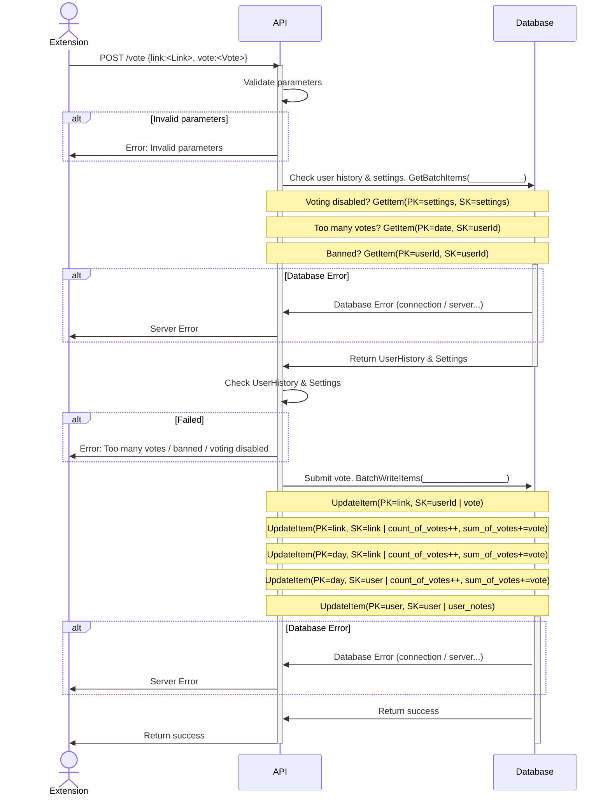

# Architecture

## Data Structures

### Link

A `String` of the hostname that represents the website, for example `"www.google.com" or "blog.myspecialplace.com"`.

[See here](https://developer.mozilla.org/en-US/docs/Web/API/Location/hostname) for a good explanation of the different pieces in the URL:
 </img>

_Right now all voting just happens on the hostname, but there could be a future where Discontent allows voting on full URL paths. This would mean being able to vote on individual Medium articles for example._

### Vote

An `Integer` that's either a +1 or -1, stored with a `Timestamp` when the vote was made. Always associated with a `User` and a `Link`.

### Timestamp

Represented everywhere as an [ISO 8601](https://en.wikipedia.org/wiki/ISO_8601) string with the specific format `2023-02-02T09:36:03Z`.

### Score

An `enum` that represents how good a website `Link` is. It has 4 possible values:

| Enum            | Definition                                              |
| --------------- | ------------------------------------------------------- |
| `Good`          | Sum of all votes >= 20                                  |
| `Bad`           | Sum of all votes <= -10                                 |
| `Controversial` | (-10 < Sum of all votes < 20) && (Number of votes > 20) |
| `NoScore`       | If none of the above                                    |

The score is calculated in the API and exposed to the extension through the `/scores` request.

In the future this will probably need to be tweaked for more nuanced scoring, like weighting recent votes higher.

### User

Identified by a `UUID`. I wanted a passwordless system and this seemed like a flexible choice. Has a number of properties:

- user_notes: `String`
- user_is_banned: `Timestamp`

### Settings

System wide configuration that can change the behaviour of everything.

- voting_is_disabled: `Boolean`

The idea behind `voting_is_disabled` is in case there's a spam armaggedon and all voting needs to be stopped.

## API

_TODO: Link to a swagger page._

| Request                                            | Response                       | Visibility                            |
| -------------------------------------------------- | ------------------------------ | ------------------------------------- |
| `GET /scores?for=[link1, link2, ...]`              | `[{link: Link, score: Score}]` | Public                                |
| `GET /vote?link=link`                              | `Vote`                         | Public                                |
| `POST /vote {link, vote, userId}`                  |                                | Public                                |
| `POST /admin/vote {link, vote, userId, timestamp}` |                                | Admin only, used for database seeding |
| `POST /admin/settings { voting_is_disabled }`      |                                | Admin only                            |

## Database

I decided to go with a NoSQL database for two reasons:

1. It'd be cool to learn.
1. My extremely basic understanding of NoSQL leads me to believe that it's better suited for what Discontent is trying to do.
   DynamoDB on AWS seems cheap enough and if this extension actually gets used and needs to scale then future Tom won't be boned.

The access patterns are reasonably well defined:

| Runtime Access Patterns       | Description                                        | Table - Filter                                            |
| ----------------------------- | -------------------------------------------------- | --------------------------------------------------------- |
| Get vote summaries for a Link | Summaries are `sum_of_votes` & `count_of_votes`    | `Table:Discontent - PK=link#<link>, SK=link#<link>`       |
| Get all votes for a Link      | To calculate `sum_of_votes` & `count_of_votes`     | `Table:Discontent - PK=link#<link>, SK.startswith(user#)` |
| Get vote for a Link and user  | To make sure a user can't vote twice               | `Table:Discontent - PK=link#<link>, SK=user#<userId>`     |
| Get vote for a Link and user  | To auto select the correct vote button             | `Table:Discontent - PK=link#<link>, SK=user#<userId>`     |
| Get vote summaries for a User | To limit the number of submissions in a time range | `Table:Discontent - PK=day#<date>, SK=user#<userId>`      |
| Get banned state for a User   | Prevent banned users from submitting more votes    | `Table:Discontent - PK=user#<userId>, SK=user#<userId>`   |

The following are analysis access patterns, not really part of regular usage.

| Analysis Access Patterns              | Description                                 | Table & Filter                                             |
| ------------------------------------- | ------------------------------------------- | ---------------------------------------------------------- |
| Get User details                      | To carry out abuse investigations           | `Table:Discontent - PK=user#<userId>, SK=user#<userId>,`   |
| Get all votes for a user              | To carry out abuse investigations           | `GSI:UserVotes - PK=user#<userId>, SK.within(timerange)`   |
| Get top users by daily count of votes | To identify possible abuse                  | `GSI:DailyUserHistory - PK=<day>, SK.top(N)`               |
| Get top links by daily count of votes | To identify possible abuse                  | `GSI:DailyLinkHistoryByCountOfVotes - PK=<day>, SK.top(N)` |
| Get top links by daily sum of votes   | To create a best links leaderboard          | `GSI:DailyLinkHistoryBySumOfVotes - PK=<day>, SK.top(N)`   |
| Get top links by daily count of votes | To create a controversial links leaderboard | `GSI:DailyLinkHistoryByCountOfVotes - PK=<day>, SK.top(N)` |

### Schema visualisations

_TODO: Add images from the NoSQL workbench_

## Sequence diagrams

### Get scores for links

### Submit a vote for a link

